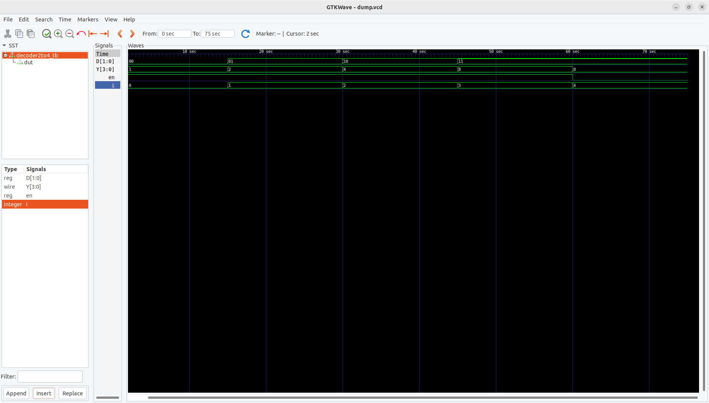

# 2x4 Decoder

A **decoder** is a combinational circuit that converts binary information from `n` input lines into `2^n` unique output lines.  
This project implements a **2-to-4 line decoder** with an enable input.

---

## 📂 Files
- **Decoder_2x4.v** → RTL code for the 2x4 decoder  
- **Decoder_2x4_tb.v** → Testbench for simulation  

---

## 🧮 Functionality
- **Inputs:**
  - `a[1:0]` → 2-bit input (selects which output is active)  
  - `en` → enable signal (decoder works only when `en = 1`)  

- **Outputs:**
  - `y[3:0]` → 4-bit output (one-hot encoded: only one line goes high at a time)  

---

## 🗂 Truth Table

| en | a1 | a0 | y3 | y2 | y1 | y0 |
|----|----|----|----|----|----|----|
| 0  |  X |  X |  0 |  0 |  0 |  0 |
| 1  |  0 |  0 |  0 |  0 |  0 |  1 |
| 1  |  0 |  1 |  0 |  0 |  1 |  0 |
| 1  |  1 |  0 |  0 |  1 |  0 |  0 |
| 1  |  1 |  1 |  1 |  0 |  0 |  0 |

---

## ⚙️ Working Principle
- The decoder checks the value of the `2-bit input (a1, a0)`.  
- Based on the combination, it activates exactly **one output line** (y0–y3).  
- If `en = 0`, all outputs remain `0`.  

This is commonly used in memory address decoding and digital circuit selection logic.

---

## ▶️ How to Simulate

### Using Icarus Verilog
```bash
iverilog -o dec_sim Decoder_2x4.v Decoder_2x4_tb.v
vvp dec_sim
gtkwave dump.vcd &

Using Xilinx ISE (ISim)

    Create a new project.

    Add Decoder_2x4.v and Decoder_2x4_tb.v.

    Set Decoder_2x4_tb.v as the top module.

    Run behavioral simulation.

📈 Waveform


