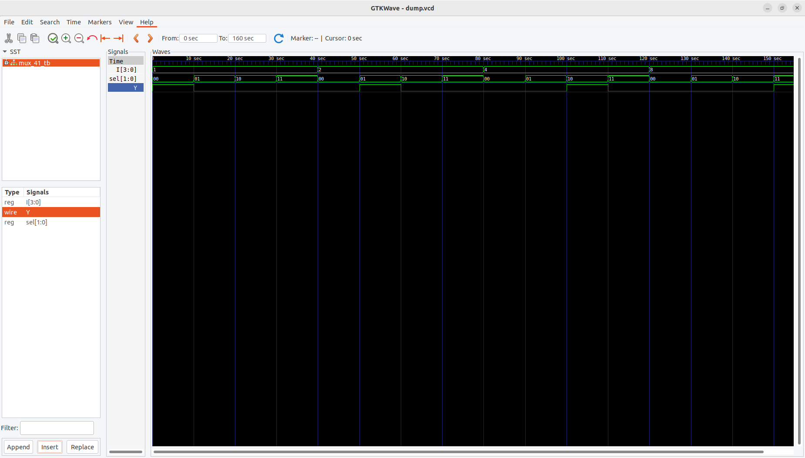

# 🎛️ 4x1 Multiplexer using 2x1 Multiplexers (Verilog HDL)

## 📘 Overview
A **Multiplexer (MUX)** is a combinational circuit that selects one of several input lines and routes it to a single output line based on select signals.  
This project implements a **4-to-1 Multiplexer** using **three 2-to-1 Multiplexers**, demonstrating hierarchical design in Verilog HDL.

---

## ⚙️ Features
- Implements a 4x1 MUX using cascaded 2x1 MUXes  
- 4 input data lines and 2 selection inputs  
- Simple hierarchical design using module instantiation  
- Generates `dump.vcd` for waveform analysis  
- Compatible with **Icarus Verilog**, **GTKWave**, and **Xilinx ISim**

---

## 📂 Files
- **mux_21.v** → RTL code for 2x1 multiplexer (basic building block)  
- **mux_41.v** → RTL code for 4x1 multiplexer (constructed from 2x1 MUXes)  
- **mux_41_tb.v** → Testbench for simulation  
- **dump.vcd** → Waveform file generated during simulation  
- **README.md** → Project documentation  

---

## 🧮 Functionality
### 🔹 Inputs:
- `I[3:0]` → Four input lines (I0, I1, I2, I3)  
- `sel[1:0]` → 2-bit select lines to choose the input  

### 🔹 Output:
- `Y` → Output corresponding to selected input line  

---

## 🗂 Truth Table

| sel[1] | sel[0] | Selected Input | Output (Y) |
|:------:|:------:|:---------------|:-----------:|
|   0    |   0    | I0             | I0          |
|   0    |   1    | I1             | I1          |
|   1    |   0    | I2             | I2          |
|   1    |   1    | I3             | I3          |

---

## ⚙️ Working Principle
The **4x1 MUX** is implemented using **three 2x1 multiplexers** arranged as follows:

1. **MUX1** → Selects between inputs `I0` and `I1` using `sel[0]`.  
2. **MUX2** → Selects between inputs `I2` and `I3` using `sel[0]`.  
3. **MUX3** → Selects between outputs of MUX1 and MUX2 using `sel[1]`.  

This modular approach forms a **hierarchical design**, where small components (2x1 MUXes) are reused to construct larger systems.

---

## 🧪 Simulation Procedure

### 🧰 Requirements
Install the following tools:
```bash
sudo apt install iverilog gtkwave
```
### ▶️ Using Icarus Verilog
```bash
iverilog -o mux_sim mux_21.v mux_41.v mux_41_tb.v
vvp mux_sim
gtkwave dump.vcd &
```

### ▶️ Using Xilinx ISE (ISim)

1.Create a new project in Xilinx ISE.
2.Add mux_21.v, mux_41.v, and mux_41_tb.v to the project.
3.Set mux_41_tb.v as the top module.
4.Run Behavioral Simulation to observe waveforms.

📊 Example Output (Console)
----- 4x1 Multiplexer Simulation -----
# sel=00 → Y=I0
# sel=01 → Y=I1
# sel=10 → Y=I2
# sel=11 → Y=I3

## 📈 Waveform


---
## 🧠 Applications

1. Data routing in digital systems
2. Control signal multiplexing
3. ALU and register file input selection
4. Communication and signal switching circuits

## ✅ Future Improvements

1. Extend to 8x1 or 16x1 MUX using parameterized design
2. Add enable input (EN) for controlled operation
3. Implement testbench automation with randomized input generation

## 🏁 Conclusion

This project demonstrates the hierarchical design of a 4x1 Multiplexer built from 2x1 Multiplexers in Verilog HDL.
The design emphasizes modularity, scalability, and clarity—core principles in digital logic and HDL design.
