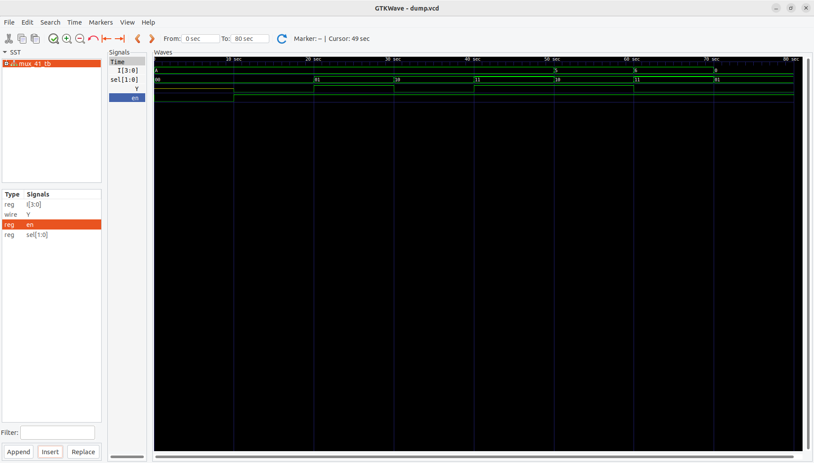

# 4x1 Multiplexer using 2x4 Decoder and Tri-State Buffers

This project implements a **4-to-1 multiplexer** using a **2-to-4 decoder** and **tri-state buffers**.  
It demonstrates how tri-state logic can be used to implement bus-based multiplexing.

---

## 📂 Files
- **tristatebuffer.v** → RTL code for Tri-State Buffer  
- **decoder2x4.v** → RTL code for 2x4 Decoder  
- **mux_41.v** → RTL code for 4x1 Multiplexer using decoder + tri-states  
- **mux_41_tb.v** → Testbench for verification  

---

## 🧮 Functionality
- **Inputs:**
  - `I[3:0]` → 4 input lines (I0, I1, I2, I3)  
  - `sel[1:0]` → 2-bit select signal  
  - `en` → enable signal  

- **Output:**
  - `Y` → selected output (driven by one input, others are high-impedance)  

---

## 🗂 Truth Table

| en | sel[1] | sel[0] | Y  |
|----|--------|--------|----|
| 0  |   X    |   X    | Z  |
| 1  |   0    |   0    | I0 |
| 1  |   0    |   1    | I1 |
| 1  |   1    |   0    | I2 |
| 1  |   1    |   1    | I3 |

---

## ⚙️ Working Principle
1. The **2x4 decoder** generates four one-hot enable signals from the 2-bit select input.  
2. Each enable line drives a **tri-state buffer** connected to one of the inputs.  
3. Only one buffer is enabled at a time → that input is placed on the output line `Y`.  
4. When `en=0`, all tri-state outputs are high-impedance (`Z`), so `Y` floats.  

---

## ▶️ How to Simulate

### Using Icarus Verilog
```bash
iverilog -o mux41_dec_sim tristatebuffer.v decoder2x4.v mux_41.v mux_41_tb.v
vvp mux41_dec_sim
gtkwave dump.vcd &

Using Xilinx ISE (ISim)

    Create a new project.

    Add tristatebuffer.v, decoder2x4.v, mux_41_decoder_tristate.v, and mux_41_tb.v.

    Set mux_41_decoder_tristate_tb.v as the top module.

    Run behavioral simulation.


📈 Waveform

