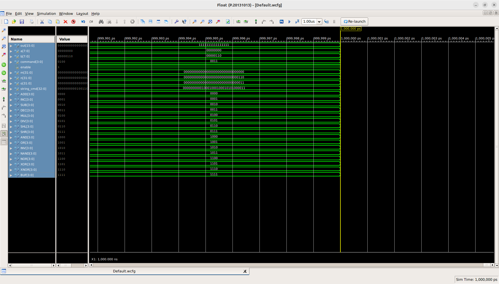

# ⚙️ Verilog ALU Project

## 📘 Overview
This project implements an **Arithmetic and Logic Unit (ALU)** in **Verilog HDL**.  
The ALU performs a variety of **arithmetic**, **logical**, and **shift** operations based on the control input (`command`).  
The design is verified using a **testbench** and simulated on **ISim** and **Icarus Verilog**.

---

## 🧠 Features
The ALU supports the following operations:

### 🔹 Arithmetic Operations
- Addition  
- Subtraction  
- Multiplication  
- Division  
- Increment  
- Decrement  

### 🔹 Shift Operations
- Logical Shift Left  
- Logical Shift Right  
- Arithmetic Shift Right  

### 🔹 Logic Operations
- AND  
- OR  
- XOR  
- NOR  
- NAND  
- XNOR  
- NOT  
- Buffer  

---

## 🏗️ Project Structure

├── alu.v # Main ALU module
├── alu_tb.v # Testbench for ALU
├── waveform.wcfg # ISim waveform configuration (optional)
├── README.md # Project documentation


---

## 🔑 ALU I/O

### Inputs
- `a` → First operand (8-bit)  
- `b` → Second operand (8-bit)  
- `command` → Control signal (selects the ALU operation)  

### Output
- `out` → Result of operation  
  - **16-bit** for multiplication  
  - **8-bit** for all other operations  

---

## 🧪 Simulation Procedure

### ▶️ Using Icarus Verilog
```bash
iverilog -o alu_sim alu.v alu_tb.v
vvp alu_sim
gtkwave alu_tb.vcd &
```
### ▶️ Using Xilinx ISE (ISim)
1. Create a new project in Xilinx ISE.
2. Add the following files:
        alu.v
        alu_tb.v
3. Set alu_tb.v as the top module.
4. Run Behavioral Simulation and observe the output waveform.

### 📊 Example Output (Console)

time=960000 | a=0 | b=6 | out=6
time=970000 | a=0 | b=6 | out=10
time=980000 | a=0 | b=6 | out=-6
time=990000 | a=0 | b=6 | out=0

## 📈 Waveform

Waveform:



Waveform Verification:
```
    ✅ Arithmetic operations (ADD, SUB, MUL, DIV, INC, DEC, SHL, SHR)

    ✅ Logical operations (AND, OR, INV)

    ✅ Bitwise operations (NAND, NOR, XOR, XNOR, BUF)

    ✅ High-impedance output when oe = 0
```
## 🚀 Future Improvements

    Add support for signed operations

    Implement overflow detection

    Extend ALU to 16-bit or 32-bit width

    Add status flags (Zero, Carry, Overflow, Negative)


## ✅ This ALU demonstrates the fundamental principles of digital computation, combining arithmetic and logic functions in a modular and extensible Verilog design.
