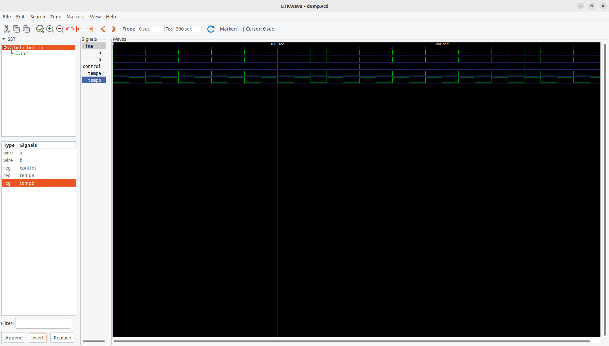

# 🔀 Bidirectional Buffer – Verilog RTL

## 📘 Overview
This project implements a **Bidirectional Buffer** in **Verilog HDL** and verifies its functionality through a **testbench simulation**.  
A bidirectional buffer enables signals to flow **in both directions**, but **only one direction at a time**, controlled by a **control signal**.

---

## 🧠 Theory
A **Bidirectional Buffer** is widely used in **shared bus architectures** where multiple devices communicate using a common data line.  
Depending on the control signal:

- When `control = 1` → data flows **from A → B**  
- When `control = 0` → data flows **from B → A**

To implement this, Verilog provides two special primitives:
- `bufif1` → passes input when control = 1, else outputs high impedance (`Z`)  
- `bufif0` → passes input when control = 0, else outputs high impedance (`Z`)

This ensures only one side drives the bus at any time, preventing **bus contention**.

---

## 📂 Files
- **bidirectional_buffer.v** → RTL code for Bidirectional Buffer  
- **bidirectional_buffer_tb.v** → Testbench for Bidirectional Buffer  

---

## ⚙️ Functionality

| Control | Data Direction | Active Buffer | Description |
|----------|----------------|----------------|--------------|
| 1 | A → B | bufif1 | A drives B |
| 0 | B → A | bufif0 | B drives A |

When one side drives the bus, the other remains in **high-impedance (`Z`)** state, ensuring safe bidirectional data transfer.

---

## ▶️ How to Simulate

### Using Icarus Verilog
```bash
iverilog -o bidbuffer_sim bidirectional_buffer.v bidirectional_buffer_tb.v
vvp bidbuffer_sim
gtkwave dump.vcd &
```
### Using Xilinx ISE (ISim)
```
    Create a new project.

    Add bidirectional_buffer.v and bidirectional_buffer_tb.v.

    Set bidirectional_buffer_tb.v as the top module.

    Run Behavioral Simulation and view the waveform.
```
### 📊 Expected Output
```
    When control = 1 → A drives B.

    When control = 0 → B drives A.

    Inactive line stays in high-impedance (Z).

The waveform will show data transfer direction switching as the control signal toggles between 0 and 1.
```
## 🧰 Applications
```
    Used in microprocessor and microcontroller data buses.

    Prevents bus contention in shared data paths.

    Found in I²C, memory buses, and bidirectional I/O ports.
```
## 📈 Waveform



