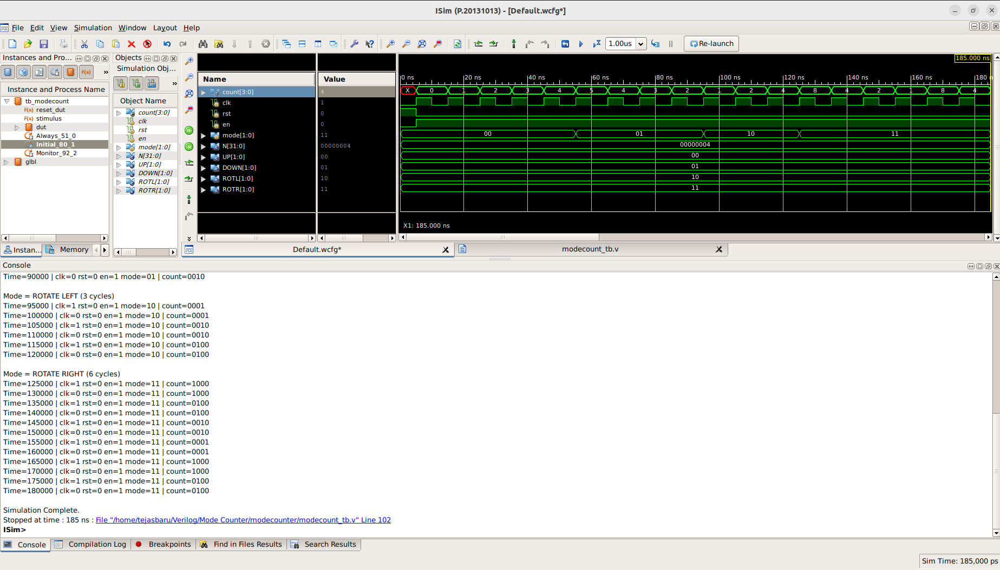

# ⚙️ N-bit Mode-Based Configurable Counter (Verilog RTL)

## 📘 Overview
This project implements a **parameterized N-bit configurable counter** in **Verilog HDL**.  
The counter supports **four operational modes** — Up Count, Down Count, Rotate Left, and Rotate Right — all controlled by a 2-bit mode input.  

This design demonstrates **synchronous sequential logic**, **parameterized RTL coding**, and **multi-mode digital control**, making it ideal for both learning and FPGA-based experimentation.

---

## 🎯 Objectives
- Design a **multi-mode counter** whose bit-width (N) can be configured at synthesis time.  
- Explore **synchronous counting and rotation operations** in digital systems.  
- Develop a **scalable and reusable RTL design** using Verilog parameters.  
- Verify functional correctness across all modes through simulation.

---

## 🧠 Theoretical Background

### 🔹 Counters in Digital Systems
Counters are sequential circuits that progress through a defined sequence of states based on clock pulses.  
They are key components in digital systems for:
- Frequency division
- Event counting
- Time measurement
- Address generation
- Control signal sequencing

### 🔹 Parameterization Concept
Parameterization allows an RTL module to operate with variable bit-widths.  
In this project, the counter width is defined by the **parameter `N`**, enabling flexible scalability without modifying internal logic.

---

### 🔹 Operating Modes

| Mode | Binary | Function | Description |
|:------|:--------|:-----------|:-------------|
| UP | `00` | Up Counter | Increments the counter value by 1 on each clock pulse |
| DOWN | `01` | Down Counter | Decrements the counter value by 1 on each clock pulse |
| ROTATE LEFT | `10` | Rotate Left | Circularly shifts all bits left (MSB wraps to LSB) |
| ROTATE RIGHT | `11` | Rotate Right | Circularly shifts all bits right (LSB wraps to MSB) |

Each operation occurs **synchronously** on the **positive edge of the clock**, and the **enable** input (`en`) determines whether counting occurs.

---

**Signal Descriptions:**

| Signal | Direction | Description |
|:-------|:-----------|:-------------|
| `clk` | Input | Clock input — triggers counter update on positive edge |
| `rst` | Input | Active-high synchronous reset; sets output to zero |
| `en` | Input | Enable signal; when high, counter operates based on mode |
| `mode[1:0]` | Input | 2-bit control signal selecting counter operation mode |
| `count[N-1:0]` | Output | N-bit counter output reflecting current state |

---

## ⚙️ Design Details

- **Parameterization:** The counter width is defined using a parameter `N`. Default value: `N = 4`.  
  You can modify `N` to 8, 16, or any desired size to scale up the design.  
- **Synchronous Reset:** The reset signal clears the counter to zero at the next positive clock edge.  
- **Mode Control:** The counter behavior changes dynamically based on the 2-bit mode input.  
- **Enable Functionality:** When `en = 0`, the counter holds its current value, pausing the sequence.  
- **No Glitches:** Since all operations are synchronous, the design avoids hazards and metastability.

---

## 🧪 Testbench Summary

The testbench verifies the counter in all four modes through a series of controlled stimuli.  
It features a **10 ns clock period**, **synchronous reset**, and uses `$monitor` and `$display` statements to track real-time behavior.

### Simulation Flow
1. Apply reset — initialize counter to all zeros.  
2. Test **Up Counting** for multiple cycles.  
3. Test **Down Counting** for multiple cycles.  
4. Test **Rotate Left** operation.  
5. Test **Rotate Right** operation.  
6. Observe stable transitions and mode-specific responses in waveform.

The waveform shows transitions corresponding to mode changes, with all updates synchronized to the rising edge of the clock.

---

## 📊 Timing & Control Characteristics

| Parameter | Description | Typical Value |
|:------------|:----------------|:----------------|
| Clock Frequency | Determines count update rate | 100 MHz (10 ns period) |
| Reset Type | Synchronous | Active High |
| Enable | Operates as counter gate | Active High |
| Counter Width | Configurable via `N` | Default: 4 bits |

---

## 🔬 Key Learnings
- Implementation of **multi-mode functionality** using a compact state control (`mode`).  
- Application of **parameterization** for scalable digital design.  
- Design and verification of **synchronous sequential circuits**.  
- Usage of **testbenches** to automate and observe simulation behavior.  
- Understanding of **bit rotation and directional shifting**.

---

## 🚀 Applications
- Programmable timers and event counters  
- Shift-register–based data manipulators  
- LED pattern generators (ring rotation effects)  
- Digital clock or frequency divider units  
- Control modules in embedded processors and DSP systems  

---

## 📈 Simulation and Verification
- **Clock Period:** 10 ns  
- **Total Simulation Time:** ~300 ns  
- **Environment:** ModelSim, GTKWave, Vivado Simulator, or any Verilog-compatible tool  
- **Verification Scope:** Functional correctness for all operational modes across N-bit width configurations  

---
## 📈 Waveform

---
## 🌱 Future Enhancements
- Add **asynchronous reset** for faster recovery.  
- Introduce **loadable initial value** functionality.  
- Add **overflow and underflow flags** for up/down modes.  
- Implement **programmable mode switching delay** for real hardware synchronization.  
- Extend design into a **multi-stage programmable counter chain**.

---

## 🧾 Summary
The **N-bit Configurable Counter** successfully demonstrates how multiple counter behaviors can be unified into one flexible RTL design.  
By using a parameterized approach, it ensures scalability and reusability across a wide range of applications — from simple educational projects to real-world digital systems.

---

