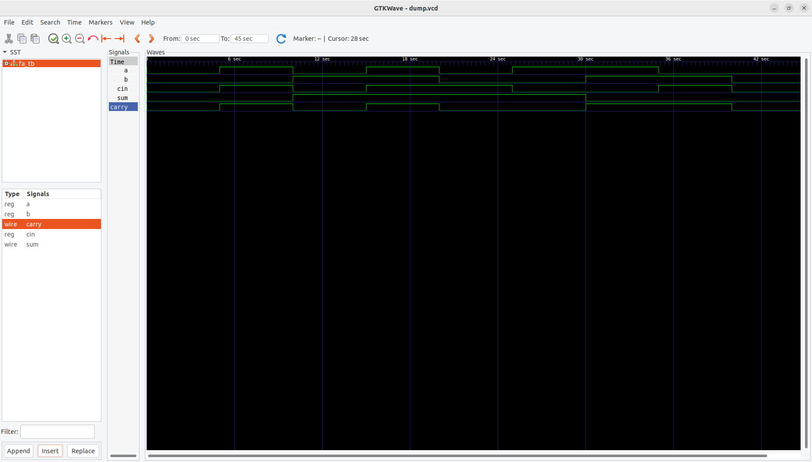

# ➕ Full Adder using Half Adder (Verilog HDL)

## 📘 Overview
This project implements a **1-bit Full Adder** using two **Half Adders** and an **OR gate** in **Verilog HDL**.  
It demonstrates the concept of **hierarchical digital design**, where a complex circuit is built using smaller, reusable modules.

---

## 📂 Files
- **half_adder.v** → RTL design for 1-bit Half Adder  
- **full_adder.v** → RTL design for Full Adder (constructed using two Half Adders and one OR gate)  
- **fa_tb.v** → Testbench for verification  

---

## 🧮 Functionality

### 🔹 Inputs:
- `a` → First input bit  
- `b` → Second input bit  
- `cin` → Carry input  

### 🔹 Outputs:
- `sum` → Output sum bit (`a ⊕ b ⊕ cin`)  
- `carry` → Carry output (`(a·b) + (cin·(a⊕b))`)  

---

## 🗂 Truth Table

| a | b | cin | sum | carry |
|---|---|-----|-----|-------|
| 0 | 0 | 0   |  0  |   0   |
| 0 | 0 | 1   |  1  |   0   |
| 0 | 1 | 0   |  1  |   0   |
| 0 | 1 | 1   |  0  |   1   |
| 1 | 0 | 0   |  1  |   0   |
| 1 | 0 | 1   |  0  |   1   |
| 1 | 1 | 0   |  0  |   1   |
| 1 | 1 | 1   |  1  |   1   |

---

## ⚙️ Working Principle
1. **Half Adder 1:** Adds inputs `a` and `b`.  
   - Outputs intermediate sum (`s1`) and carry (`c1`).  
2. **Half Adder 2:** Adds `s1` and `cin`.  
   - Outputs final sum and intermediate carry (`c2`).  
3. **Final Carry:** Computed as `c1 OR c2`.  

This modular structure illustrates how smaller combinational blocks can be combined to create more complex logic systems.

---

## ▶️ How to Simulate

### Using Icarus Verilog
```bash
iverilog -o fa_ha_sim half_adder.v full_adder.v fa_tb.v
vvp fa_ha_sim
gtkwave dump.vcd &
```
### Using Xilinx ISE (ISim)
```
    Create a new project.

    Add half_adder.v, full_adder.v, and fa_tb.v.

    Set fa_tb.v as the top module.

    Run Behavioral Simulation and analyze waveforms.
```
##📈 Waveform


---

## 🧠 Applications
```
    Basic arithmetic circuits

    ALU design components

    Binary adder/subtractor units

    Cascading to build multi-bit adders (e.g., Ripple Carry Adder)
```
## 🏁 Conclusion

This project demonstrates the hierarchical design approach by implementing a 1-bit Full Adder using two Half Adders and an OR gate.
It is a fundamental building block for constructing multi-bit arithmetic circuits in digital systems.
