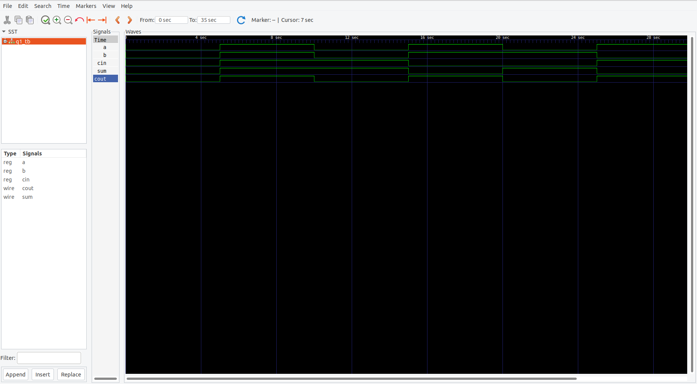

# ➕ Full Adder (Verilog HDL)

## 📘 Overview
A **Full Adder** is a **combinational logic circuit** that performs the arithmetic addition of **three input bits** — two operands (`a`, `b`) and a **carry input** (`cin`).  
It produces two outputs: the **sum** and the **carry-out**.  

---

## 📂 Files
- **fa.v** → RTL design for 1-bit Full Adder  
- **fa_tb.v** → Testbench for verification  

---

## 🧮 Functionality

### 🔹 Inputs:
- `a` → First input bit  
- `b` → Second input bit  
- `cin` → Carry input  

### 🔹 Outputs:
- `sum` → Output bit representing `(a ⊕ b ⊕ cin)`  
- `carry` → Output carry bit representing `((a & b) | (b & cin) | (a & cin))`  

---

## 🗂 Truth Table

| a | b | cin | sum | carry |
|---|---|-----|-----|-------|
| 0 | 0 | 0   |  0  |   0   |
| 0 | 0 | 1   |  1  |   0   |
| 0 | 1 | 0   |  1  |   0   |
| 0 | 1 | 1   |  0  |   1   |
| 1 | 0 | 0   |  1  |   0   |
| 1 | 0 | 1   |  0  |   1   |
| 1 | 1 | 0   |  0  |   1   |
| 1 | 1 | 1   |  1  |   1   |

---

## ⚙️ Working Principle
- The **sum** output is generated using a **three-input XOR operation**:  
  `sum = a ⊕ b ⊕ cin`  
- The **carry** output is produced using **majority logic**:  
  `carry = (a & b) | (b & cin) | (a & cin)`  

This logic ensures correct arithmetic addition at the bit level.

---

## ▶️ How to Simulate

### Using Icarus Verilog
```bash
iverilog -o fa_sim fa.v fa_tb.v
vvp fa_sim
gtkwave dump.vcd &
```
### Using Xilinx ISE (ISim)
```
    Create a new project.

    Add fa.v and fa_tb.v.

    Set fa_tb.v as the top module.

    Run Behavioral Simulation.
```
## 📈 Waveform


## 🧠 Applications
```
    Used in Arithmetic Logic Units (ALUs)

    Binary addition in processors

    Building block for multi-bit adders like Ripple Carry or Carry Look-Ahead Adders
```
### 🏁 Conclusion

The Full Adder combines three inputs to produce accurate sum and carry outputs.
It serves as a fundamental element in digital arithmetic and processor design.
